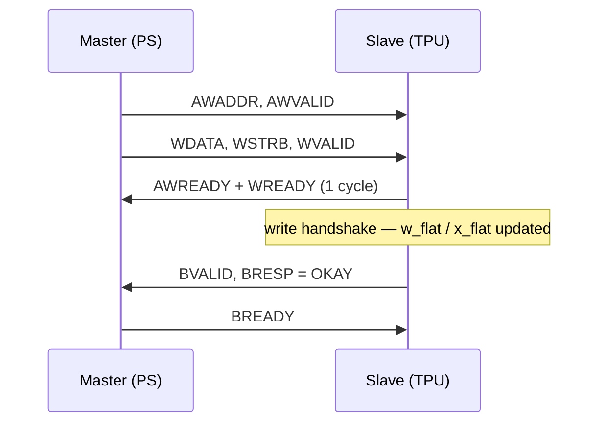
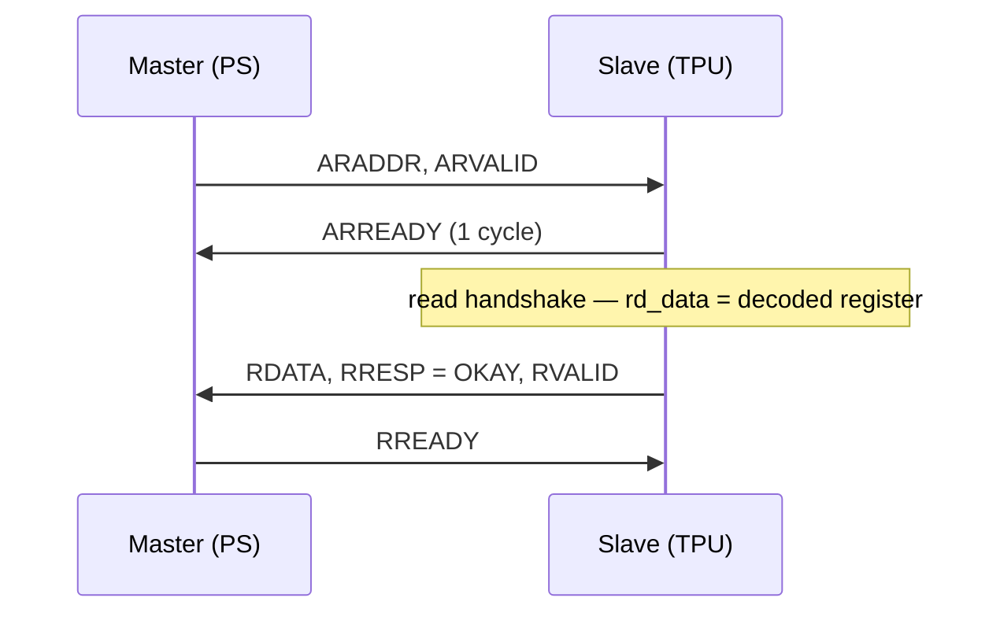
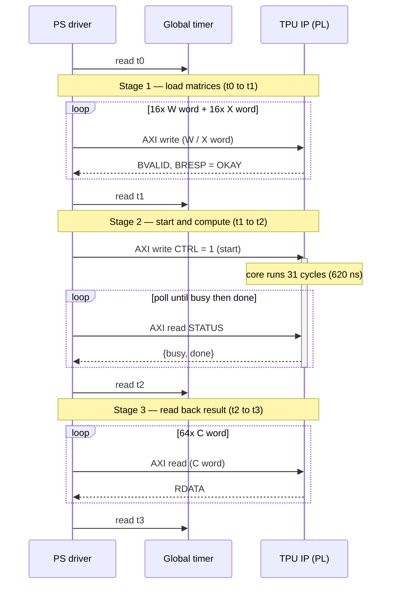
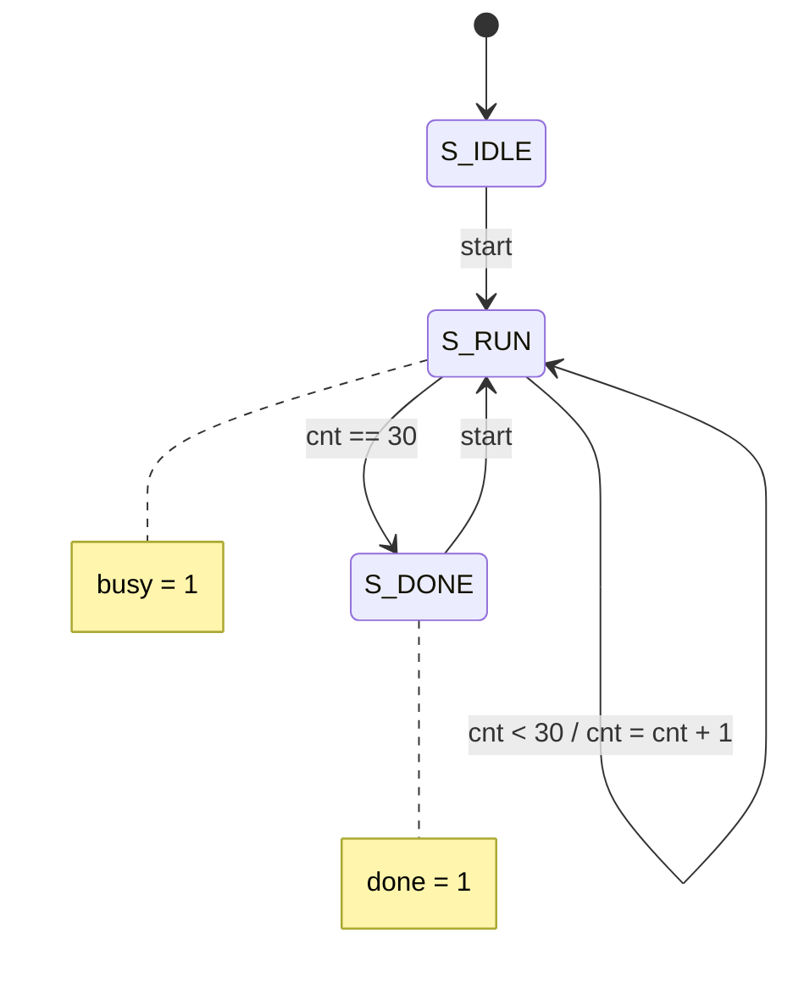

# Execution Timeline - PS / PL Interaction

This document traces a single matmul run from the processing system (PS) side,
showing how the PS driver interacts with the TPU IP in the programmable logic
(PL): what AXI transactions are issued, what signals carry them, and what the
TPU core does internally while the run is in progress.

## Clock domains

There is a single fabric clock. The AXI4-Lite slave interface and the TPU core
both run on `s_axi_aclk` = FCLK_CLK0 = **50 MHz**. The ARM CPU runs at ~667 MHz
internally, but every transaction it issues to the PL is serviced in the 50 MHz
domain.

The driver brackets the run with reads of the Zynq global timer, a free-running
64-bit counter that increments at half the CPU frequency (~333 MHz). The four
capture points are named `t0`, `t1`, `t2`, `t3`. The timer is the measurement
stopwatch only — it is not part of the TPU data path.

## AXI signals

Every PS↔PL interaction is an AXI4-Lite transaction across two channels.

**Write transaction** (a CPU store / `Xil_Out32`):

| Phase | Signals |
|---|---|
| Address | `AWADDR`, `AWVALID` / `AWREADY` |
| Data | `WDATA`, `WSTRB`, `WVALID` / `WREADY` |
| Response | `BRESP`, `BVALID` / `BREADY` |

**Read transaction** (a CPU load / `Xil_In32`):

| Phase | Signals |
|---|---|
| Address | `ARADDR`, `ARVALID` / `ARREADY` |
| Data | `RDATA`, `RRESP`, `RVALID` / `RREADY` |

The slave decodes a 32-bit word index from `awaddr[8:2]` / `araddr[8:2]`.
`WSTRB` is `0xF` for every 32-bit store. `BRESP` and `RRESP` are hardwired to
`00` (OKAY).

Write handshake:

Read handshake:

## Register map

| Offset | Name | Access | Word index | Purpose |
|---|---|---|---|---|
| `0x000` | `CTRL` | write | 0 | bit 0 = start |
| `0x004` | `STATUS` | read | 1 | bit 0 = done, bit 1 = busy |
| `0x040`–`0x07C` | `W` | write | 16–31 | weight matrix, 16 words |
| `0x080`–`0x0BC` | `X` | write | 32–47 | activation matrix, 16 words |
| `0x100`–`0x1FC` | `C` | read | 64–127 | result matrix, 64 words |

## Run overview

---

## Stage 1 — t0 → t1: load the matrices

`t0` is a CPU-internal register read with no PL traffic. The driver then issues
**32 write transactions**: 16 words of the weight matrix followed by 16 words of
the activation matrix.

For each write:

1. The CPU issues a store, which travels CPU → M_AXI_GP0 → AXI SmartConnect →
   TPU slave.
2. The slave waits until **both** `AWVALID` and `WVALID` are asserted, then
   pulses `AWREADY` and `WREADY` together for one cycle. That cycle is the write
   handshake.
3. On the handshake, the decoded word is committed into the `w_flat` or
   `x_flat` register, byte-merged under `WSTRB`.
4. The slave raises `BVALID`; the master returns `BREADY`; the store completes.

Address decode: `0x040 + k*4` → index 16–31 → `w_flat`; `0x080 + k*4` →
index 32–47 → `x_flat`.

After the 32 writes, `w_flat` holds all 64 weight bytes and `x_flat` holds all
64 activation bytes. No computation has occurred. The TPU core computes
`C = X · W`. This stage is dominated by the round-trip latency of 32 MMIO
stores.

## Stage 2 — t1 → t2: start and compute

### The start signal

A single write to `CTRL` (offset `0x000`, index 0) carries the start request.
On the write handshake, `start_pulse` is loaded with `wdata[0]`. `start_pulse`
is a **one-cycle pulse**: it is cleared to 0 every cycle and only overridden by
a CTRL write.

### The core run

`tpu_core` observes `start = 1` while in `S_IDLE` or `S_DONE`, transitions to
`S_RUN`, resets `cnt` to 0, and asserts `busy`. It then executes a fixed
**31-cycle** sequence as `cnt` advances 0 → 30:

| `cnt` | Phase | Activity |
|---|---|---|
| 0–7 | LOAD | Weight rows are pushed into the 8×8 PE array, one row per cycle, row 7 first (`wrow = 7 − cnt`). Weights latch in place and stay (weight-stationary). |
| 8–15 | STREAM | Activation rows 0–7 enter the input skew buffer, which staggers them so the array receives a diagonal wavefront. |
| 16–22 | PROPAGATE | Partial sums march down the array and through the output skew buffer. No externally visible action. |
| 23–30 | CAPTURE | Result rows 0–7 are read out of the output skew buffer into `c_mat`, one row per cycle. |

At `cnt == 30` (`RUN_LAST = 4N − 2`) the core transitions to `S_DONE`: `busy`
deasserts and `done` asserts. The run is 31 cycles × 20 ns = **620 ns**.

```mermaid
gantt
    title tpu_core run — cycle count (cnt 0..30)
    dateFormat X
    axisFormat %s
    section Core
    LOAD 0-7        :0, 8
    STREAM 8-15     :8, 8
    PROPAGATE 16-22 :16, 7
    CAPTURE 23-30   :23, 8
```

### Status polling

While the core runs, the PS spins on reads of `STATUS` (offset `0x004`), which
returns `{30'b0, core_busy, core_done}`:

1. `while ((STATUS & 2) == 0)` — wait for `busy = 1`, confirming the run has
   started.
2. `while ((STATUS & 1) == 0)` — wait for `done = 1`.

The busy-first check is required because `done` remains asserted from the
previous run until a new `start` clears it. Polling `done` alone would observe
stale data on any run after the first.

## Stage 3 — t2 → t3: read back the result

The driver issues **64 read transactions** of offsets `0x100 + n*4`
(index 64–127). Each read decodes to a 32-bit slice of `c_flat`, which is wired
directly from the core's `c_mat` register and is stable once `done` is
asserted. Each read drives `ARVALID` → `ARREADY` (the read handshake), latches
`RDATA`, and completes via `RVALID` / `RREADY`.

`t3` is the final global-timer read, closing the measurement window.

## Summary of measured intervals

| Interval | Covers |
|---|---|
| `t1 − t0` | 32 AXI writes loading W and X |
| `t2 − t1` | CTRL start write plus the busy/done polling loop |
| `t3 − t2` | 64 AXI reads retrieving C |
| `t3 − t0` | Full run: load, compute, read back |
